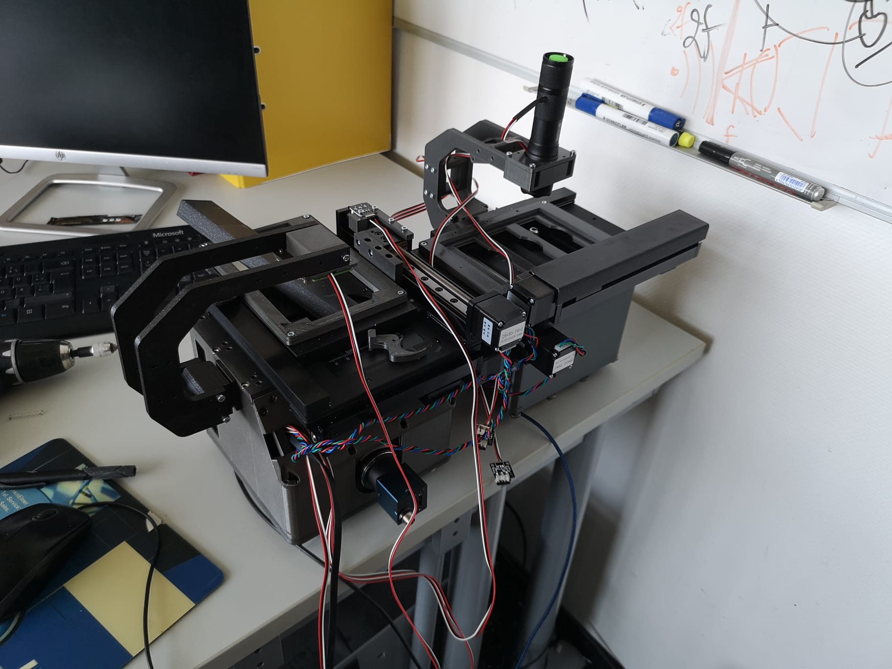
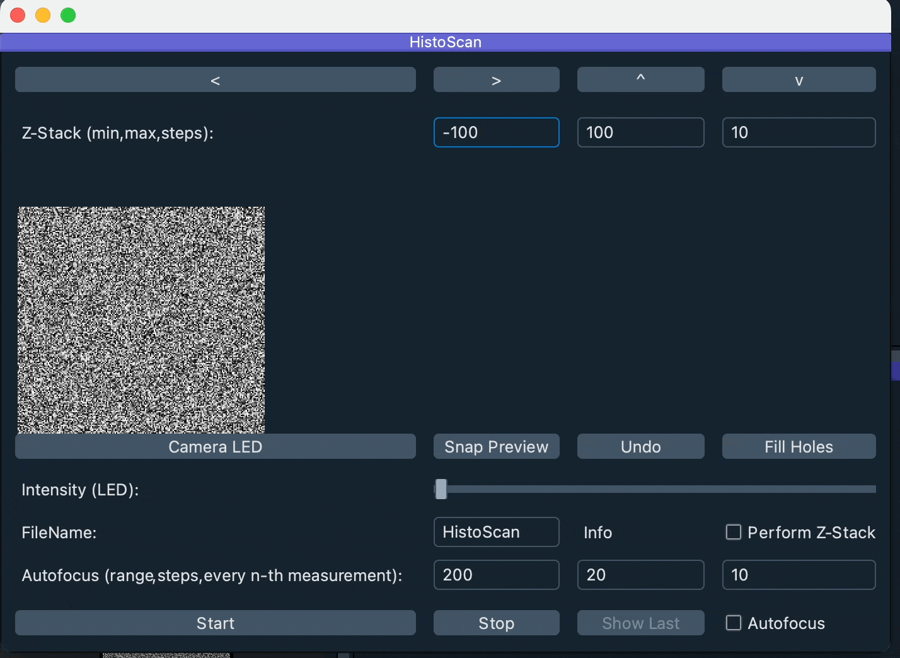

# HistoScanner - An open-source slidescanning system for histological slides using ImSwitch and ASHLAR

Welcome to the openOCT Hackathon! In this hackathon, we will be addressing the crucial need for an open-source slide scanner that can help capturing large area microscopic samples for example for digital pathology. We will provide an openUC2-based XYZ stage scanning microscope that can be hooked up to the ImSwitch microscopy control software. The challenge is to automate the acquisition process and buildup a pipeline that adapts the data to the stitching software ASHLAR (https://github.com/labsyspharm/ashlar/)

## Motivation

- microscopy is the primary tool to identify cancer in tissue
- A large variation of different labeling strategies can identify different parts of the cell/tissue (e.g. HeMa, Antibody labelling..)
- Doing that manually is labour and time consuming
- Doing that digitally with commercially available devices is expensive and often not open since data cannot be extracted
- Not possible to integrate the device into exisiting workflows
- We need a low-cost tool that can do large area scanning of microscopic samples in a fast and open manner
- Data has to be captured in such a way that it can interact with open-source data analysis pipelines such as ASHLAR for stitching and QPath for data annotation and analysis
- The hackathons' goal is to kick-off an open-source IMSwitch/UC2-based Slidescanner to ultimatively be integrated into fully auonomous workflows (e.g. using robots, liquid handling robots)

## Goal

(as nicely summarized by Andrew):

### Primary Goals
- Ensuring proper relation between physical coordinates (sample plane) and "digital" coorindates (e.g. pixel location, xyz steps for motors)
- Calibrate the dimensions - in best case autonomously
- Working end to end solution to stitch image tiles into an `.ome.tiff` (or equivalent)
- Brightfield imaging using an RGB camera   
- Ability to define a region of interest to be scanned (for example, defining a bounding box)
- "Pre-scanning" (low resolution thumbnail)
- Time estimate for total slide scan
- Measure the approximate error of the scanner in relation with the indicated xy positions (should be <300um for stitching multiplexed images in Ashlar
- Automatic & Manual Focus setting adjustments

### Secondary Goals
- Lossless image generation
- Fluorescence imaging
- Hardware and Software Integration into Opentrons2
- barcode label scanning

ImSwitch Plugin vs REST API

## Background

## Current State: Building the Prototype

### Setting up and Adapting

### Optical Setup

### test Setup

### Code

#### ESP32

#### PYTHON

#### Image Processing

#### ImSwitch

We want to be able to use this as an online-running widget that includes the goals from above. For this we can base our work on the HistoScan Widget and Controller in ImSwitch (UC2). Relevant code passages are

*The Widget*
https://github.com/openUC2/ImSwitch/blob/master/imswitch/imcontrol/view/widgets/HistoScanWidget.py

*The Controller*
https://github.com/openUC2/ImSwitch/blob/master/imswitch/imcontrol/controller/controllers/StandaPositionerController.py

*The Manager*
https://github.com/openUC2/ImSwitch/blob/master/imswitch/imcontrol/model/managers/HistoScanManager.py

*The ESP32-based camera* (for the coarse prescan from above)
https://github.com/openUC2/ImSwitch/blob/d3009b2dd669fbee273cca770c87c8c80d0c5940/imswitch/imcontrol/model/interfaces/CameraESP32CamSerial.py#L37

The general mockup looks like this:

### How to set up?

## Safety

## Challenge

### Varitions

## When Goal is met?

- have one working system
- Detect the focus as one number from the astimatism as a function of the z-position
- have a controller that may give step-values for the focus motor
- have a functioning focuscontroller inside imswitch that can keep the focus

## Ressources
- https://hackaday.com/2021/02/02/dvd-optics-power-this-scanning-laser-microscope/

## License
